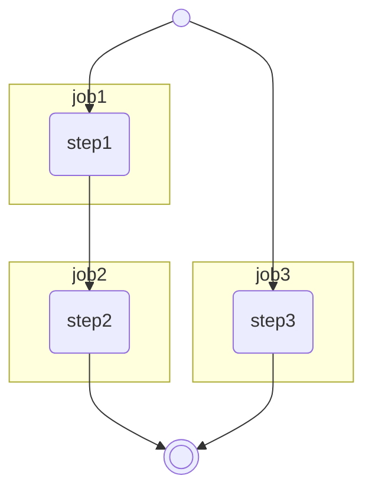

# 演習問題

ジョブを複数定義して、ジョブ間の依存関係を定義してみましょう。

## 問題


|name|spec|
|---|---|
|step1|コンソールに`step1`と表示する|
|step2|コンソールに`step2`と表示する|
|step3|コンソールに`step1`と表示する|

## 回答例

<details>
```yaml
name: 演習1

on:
  workflow_dispatch:

jobs:
  exercise-1:
    runs-on: ubuntu-latest
    steps:
      - run: echo "Hello, GitHub Actions."

```
</details>