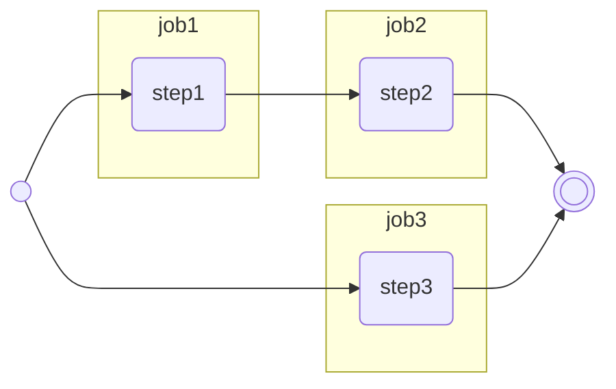

# 演習問題

ジョブを複数定義して、ジョブ間の依存関係を定義してみましょう。

## 問題

下記の実行結果になるようにジョブを関連付けてください。  
ステップの処理内容は自由、イベントは手動実行とします。  



## ゴール

* 意図した通りにジョブの依存関係を組めた

## 回答例

<details>

```yaml
name: 演習2

on:
  workflow_dispatch:

jobs:
  job1:
    runs-on: ubuntu-latest
    steps:
      - name: step1
        run: echo 'step1'
  job2:
    needs: job1
    runs-on: ubuntu-latest
    steps:
      - name: step2
        run: echo 'step2'
  job3:
    runs-on: ubuntu-latest
    steps:
      - name: step3
        run: echo 'step3'
```

</details>