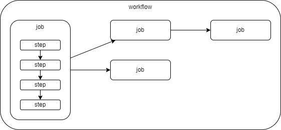

# GitHub Actionsの基礎

|名称|説明|
|---|---|
|ワークフロー(workflow)|1つ以上のジョブで構成される|
|ジョブ(Job)|1つ以上のステップで構成される|
|ステップ(Step)||

.github/workflowsディレクトリ内にYAMLファイルを作成して、ワークフローを定義します。
各ワークフローはトリガー（例: プッシュ、プルリクエスト、スケジュール）によって実行されます。

ジョブは並行して実行することも可能で、依存関係を定義することもできます。

アクション
各ステップではアクション（Action）を実行します。アクションは再利用可能なスクリプトで、公式のアクションマーケットプレイスから取得できます。

シークレットと環境変数
セキュアな情報（シークレット）や環境変数を使用して、ワークフロー中に機密情報を安全に扱えます。
